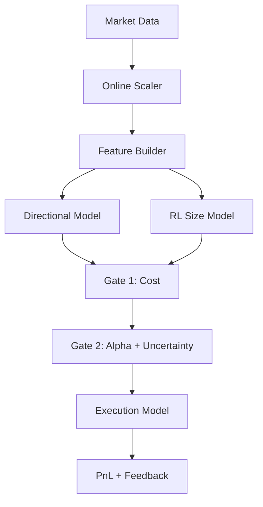

# v455 Backtest Analysis and Creative Solutions

## AIとしての所感
このプロジェクトは「Gateで守る前提」で組み立てられていますが、根本のAlphaが弱い場合はGateが正しく拒否しているだけになります。現状の勝率24%は、構造的な学習ミスマッチとデータリークの影響が疑われ、ここを潰さない限りチューニングの微調整では回復しません。

---

## Executive Summary
- **最重要**: データリークの可能性を最優先で除去しない限り、得られる改善は偽陽性になりやすい。
- **勝率24%の主因**: 「学習報酬と実行コストのミスマッチ」「逆張りバイアス」「Gate/Envの分布ずれ」が複合している疑いが高い。
- **Gateの次の進化**: コストと勝率だけでは足りない。**流動性・不確実性・相関**を入れて、勝率ではなく「優位性の安定度」を見る。
- **再設計も視野**: SACを主役にせず、**教師あり + バンドit + ルール**の三層で勝ち筋だけを狙う設計に変えるのが現実的。

---

## 1. データリーク問題への抜本的対策

### 1.1 原因仮説
`HeavyTradingEnv`で全期間の統計量を使ってスケーリングしている場合、将来情報が特徴量に混入し、**見せかけの予測精度**が生まれる。結果として、本番相当では性能が崩壊する。

### 1.2 リークを断つための設計
#### A. ローリングスケーリング（固定窓）
過去W本のみでスケーリング。未来は見ない。
```
z_t = (x_t - median(x_{t-W:t-1})) / (MAD(x_{t-W:t-1}) + eps)
```
- メリット: リーク除去が明確
- デメリット: Wが短いとノイズ増

#### B. オンライン更新（逐次）
Welford法で逐次平均・分散を更新。
```
mean_t = mean_{t-1} + (x_t - mean_{t-1}) / t
var_t  = var_{t-1} + (x_t - mean_{t-1}) * (x_t - mean_t)
z_t = (x_t - mean_t) / sqrt(var_t / (t-1) + eps)
```
- メリット: 安定
- デメリット: 非定常に弱い

#### C. EWMAスケーリング（非定常耐性）
```
mu_t = alpha * x_t + (1 - alpha) * mu_{t-1}
sigma_t^2 = alpha * (x_t - mu_t)^2 + (1 - alpha) * sigma_{t-1}^2
z_t = (x_t - mu_t) / (sigma_t + eps)
```
- メリット: 非定常への適応性
- デメリット: alphaの選定が難しい

### 1.3 漏洩検知テスト
- **Leakage Audit**: 学習データの終端とテスト開始点でスケーリング統計量が連続的に変化しているかを確認する。
- **Sanity Check**: シーケンスを逆順にして精度が大幅に落ちるか確認（落ちないならリーク疑い）。

---

## 2. 低勝率(24%)の打破

### 2.1 SACの見ている特徴量は「逆張り偏り」になっていないか
短期HFTでの低勝率は、以下の疑いが強い:
- RSIや短期リバース系特徴量が強すぎる
- トレンド継続シグナル（傾き、傾斜の持続時間）が弱い

### 2.2 報酬設計の矛盾
現状は環境報酬とGateのEV判定が一致していない。
```
r_t = pnl_t - fee_t - slippage_t - lambda * turnover_t - k * drawdown_t
```
- SACがこの報酬を見ていないなら、Gateは「別の物差し」で評価しているだけになる。
- まず**報酬とGateの一致**を優先すべき。

### 2.3 低勝率の改善策（実務寄り）
- **方向性モデルを別に持つ**: 方向当て（up/down）を教師ありで学習し、SACはサイズとタイミングに専念させる。
- **トレンド/逆張りを切り替える**: レジーム別にポリシーを分け、混在を避ける。
- **行動の罰則**: 連続小利益の乱打を避けるため、売買回数に罰則を入れる。

具体例:
```
reward = pnl - fee - slippage
reward -= 0.5 * abs(position_change)          # churn penalty
reward -= 2.0 * max(0, drawdown - 0.02)       # drawdown penalty
```

### 2.4 カリキュラム案（段階的強化）
1. **Phase 1**: Gate無効、コスト込み報酬のみでSAC学習
2. **Phase 2**: Gateを「コストのみ」で有効化（EVは不使用）
3. **Phase 3**: GateをEV化（p_win_meanから開始し、n_effで重み付け）

---

## 3. Gateシステムの進化

### 3.1 追加すべき指標
現在のGateは「コスト」「勝率推定」に依存し過ぎている。
以下を加えることで、**機会の質**を測れる。

| 指標カテゴリ | 例 | 意図 |
| --- | --- | --- |
| 流動性 | 出来高/ATR, Volume Z-score | 約定コストの安定性 |
| 不確実性 | エントロピー, ensemble分散 | 予測が揺れているなら取らない |
| 相関市場 | 先物ベーシス, 他取引所価格 | 偽シグナル除外 |
| レジーム安定度 | regime persistence | レジームの信頼度 |

### 3.2 Gateの拡張EV
```
EV_adj = EV - risk_penalty - uncertainty_penalty
risk_penalty = k1 * vol + k2 * drawdown
uncertainty_penalty = k3 * action_entropy
```

### 3.3 2段階Gate案
1. **Cost Gate**: コストがATRのx%以下なら通す
2. **Alpha Gate**: EVが正のときのみ通す

```
if cost > k * ATR: reject
elif EV > 0: accept
else: reject
```

---

## 4. クレイジーなアイデア (Out-of-the-box)

### 4.1 SACを捨てる：教師あり + バンドit
- 方向予測は分類器 (XGBoost, LightGBM)
- どの戦略を使うかはバンドitで選択

```
P(up) > 0.55 AND spread < threshold -> trend strategy
P(up) < 0.45 AND volatility high -> mean-reversion strategy
```

### 4.2 RLは「サイズ」だけに限定
方向性はルール、RLはロットサイズ最適化のみ。

### 4.3 アンサンブルゲート
Gateを3種持ち、投票で決定。
- Conservative Gate
- Neutral Gate
- Opportunistic Gate

### 4.4 ルールベース混入
- 高ボラ時は完全停止
- ATR急拡大時のみトレード許可

### 4.5 取引所を横断する視点
- BTC/JPY以外の相関市場（BTC/USD、ETH/BTC、先物ベーシス）
- クロス市場のズレを短期シグナルとして利用

---

## 5. 新アーキテクチャ例（Mermaid）



---

## 6. 明日から着手すべき優先タスク
1. **リーク排除**: ローリング/オンラインスケーラを導入し、全期間統計を禁止
2. **報酬とGateの一致**: コストを報酬に含める
3. **方向性モデル分離**: SACをサイズ専用にするか、教師あり分類器を追加
4. **Gate拡張**: 不確実性・流動性・相関を追加
5. **A/B実験**: SAC単独 vs 教師あり + Gate vs ルール混入

---

## 7. 最後に
Gateは悪者ではなく「現状のAlphaの弱さ」を可視化している可能性が高いです。
本質的に勝てるシグナルがなければ、Gateを緩めても負けます。
**まず勝ち筋（Alpha）を作り、その上でGateで守る**。これが唯一の正攻法です。

## 8. Next Step: Implementation Plan
Based on this analysis, a concrete implementation plan for **Online Scaling** and **Multi-Timeframe System** has been created.
See: [06_implementation_plan_mtf_online_scaling.md](06_implementation_plan_mtf_online_scaling.md)
